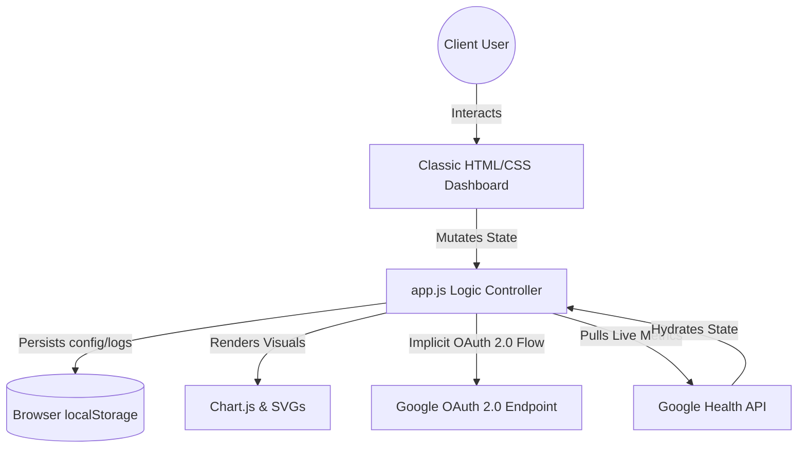

# Fitbit Classic - Technical Architecture

This document outlines the software architecture, data flow, integration interfaces, and state management lifecycle of the **Fitbit Classic** web application.

---

## 1. System Overview

Fitbit Classic is a **100% decentralized, client-side single page application (SPA)**. It communicates directly with the Google Health API and persists configuration and logged data locally within the user's browser storage. This guarantees zero server costs, maximum privacy, and absolute user ownership of data.



---

## 2. Authentication & Data Sync (Google Health API)

The application utilizes **Google OAuth 2.0 Client-Side Implicit Grant Flow**. Because the legacy Fitbit Web API is scheduled for deprecation in September 2026, we integrate directly with Google Cloud developer credentials.

### Implicit Grant Flow Lifecycle:
1. User clicks "Connect Fitbit/Google Health".
2. Application redirects the browser to Google's OAuth 2.0 Server:
   `https://accounts.google.com/o/oauth2/v2/auth?response_type=token&client_id=[GOOGLE_CLIENT_ID]&redirect_uri=[CALLBACK_URI]&scope=https://www.googleapis.com/auth/health.activity.read`
3. After the client authenticates and grants data permissions, Google redirects back with the token in the URL fragment (`#access_token=xyz`).
4. `app.js` extracts the Google access token, stores it securely inside `localStorage`, and strips it from the address bar using `history.replaceState()`.
5. Future API queries fetch health data bundles directly from the Google Health resource endpoints using the Authorization header:
   `Authorization: Bearer [access_token]`


---

## 3. Data Schema & Persistence

All app variables are stored within a single JSON object in `localStorage` under the key `fitbit_classic_state`. This includes configurations, current metrics, workouts, and historical data logs:

```json
{
  "goals": {
    "steps": 10000,
    "calories": 2200,
    "distance": 5.0,
    "active": 30
  },
  "metrics": {
    "steps": 7854,
    "caloriesBurned": 1450,
    "distance": 3.4,
    "activeMin": 22,
    "sleepHours": 7.4,
    "sleepScore": 82,
    "stressScore": 78,
    "stressMood": "Calm & Balanced",
    "caffeineMg": 250,
    "waterOz": 32,
    "foodCalories": 1450
  },
  "workouts": [
    { "type": "Running", "duration": 20, "calories": 250, "time": "08:15 AM" }
  ],
  "caloriesHistory": [
    { "date": "May 30", "caloriesIn": 1950, "caloriesOut": 2150 },
    { "date": "Today", "caloriesIn": 1450, "caloriesOut": 1700 }
  ],
  "visibleTiles": {
    "sleep": true,
    "stress": true,
    "caffeine": true,
    "food": true,
    "workout": true,
    "water": true,
    "chart": true
  }
}
```

---

## 4. UI Layout & Modularity
- **Grid Layout**: The dashboard grid relies on a CSS Grid auto-fit grid container (`grid-template-columns: repeat(auto-fill, minmax(320px, 1fr))`). 
- **Card Hiding**: The "Customizer" sidebar applies the `.hidden-card` class (`display: none !important`) to cards based on the toggle switches.
- **Dynamic Charting**: Historical visual metrics are compiled dynamically using **Chart.js** canvases inside cards. Every metric update or past day logging event destroys the existing active Chart instance and instantiates a clean, newly scaled graph representation.
